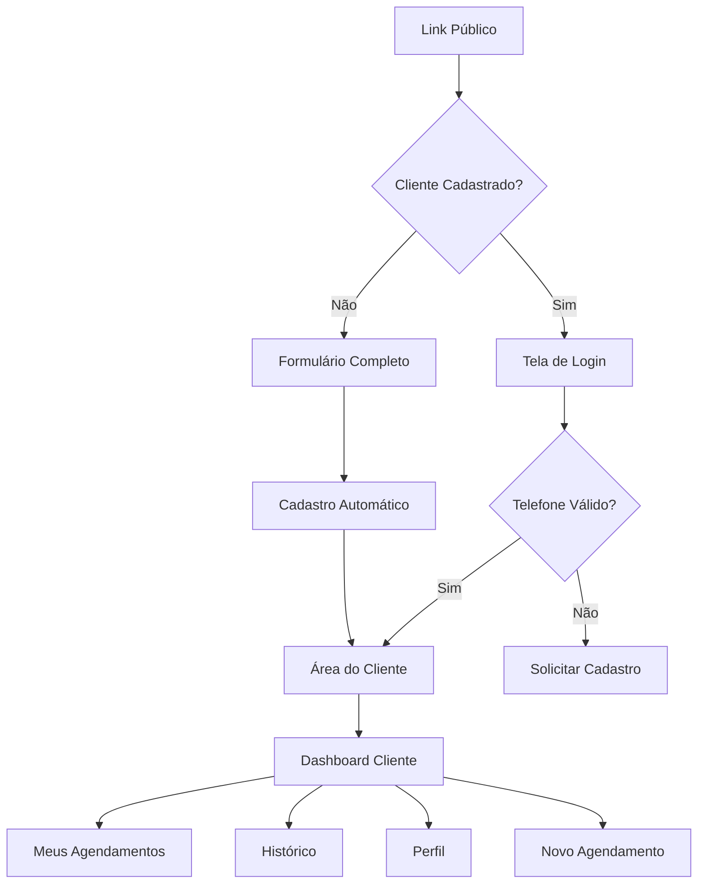

# Design Document

## Overview

Este documento detalha o design do sistema de área do cliente para o ZapAgenda, implementando autenticação por telefone, cadastro automático e uma interface dedicada para clientes gerenciarem seus agendamentos. O sistema utiliza uma arquitetura baseada em sessões simples e integração com o banco de dados existente.

## Architecture

### Estrutura de Componentes

```
src/
├── pages/
│   ├── ClientLogin.tsx          # Tela de login do cliente
│   ├── ClientDashboard.tsx      # Dashboard principal do cliente
│   ├── ClientAppointments.tsx   # Lista de agendamentos
│   ├── ClientHistory.tsx        # Histórico de agendamentos
│   └── ClientProfile.tsx        # Perfil do cliente
├── components/
│   ├── client/
│   │   ├── ClientHeader.tsx     # Header com menu do cliente
│   │   ├── ClientMenu.tsx       # Menu dropdown
│   │   ├── AppointmentCard.tsx  # Card de agendamento
│   │   └── NewBookingForm.tsx   # Formulário de novo agendamento
├── hooks/
│   ├── useClientAuth.ts         # Autenticação do cliente
│   ├── useClientData.ts         # Dados do cliente
│   └── useClientBookings.ts     # Agendamentos do cliente
├── services/
│   ├── clientAuthService.ts     # Serviços de autenticação
│   └── clientBookingService.ts  # Serviços de agendamento
└── types/
    └── client.ts                # Tipos TypeScript
```

### Fluxo de Navegação



## Components and Interfaces

### 1. Sistema de Autenticação

#### ClientLogin Component
```typescript
interface ClientLoginProps {
  companySlug: string;
  onLoginSuccess: (client: ClientData) => void;
}

interface LoginFormData {
  phone: string;
}
```

#### useClientAuth Hook
```typescript
interface ClientAuthState {
  client: ClientData | null;
  isAuthenticated: boolean;
  loading: boolean;
  error: string | null;
}

interface ClientAuthActions {
  loginByPhone: (phone: string) => Promise<boolean>;
  logout: () => void;
  refreshClient: () => Promise<void>;
}
```

### 2. Dashboard do Cliente

#### ClientDashboard Component
```typescript
interface ClientDashboardProps {
  client: ClientData;
  companySlug: string;
}

interface DashboardData {
  upcomingAppointments: ClientAppointment[];
  recentActivity: ActivityItem[];
  quickActions: QuickAction[];
}
```

#### ClientHeader Component
```typescript
interface ClientHeaderProps {
  client: ClientData;
  companyName: string;
  onMenuAction: (action: MenuAction) => void;
}

type MenuAction = 'appointments' | 'history' | 'profile' | 'new-booking' | 'logout';
```

### 3. Gerenciamento de Agendamentos

#### ClientAppointments Component
```typescript
interface ClientAppointmentsProps {
  client: ClientData;
  companyId: string;
}

interface AppointmentFilters {
  status: 'upcoming' | 'past' | 'cancelled' | 'all';
  dateRange: DateRange;
}
```

#### NewBookingForm Component
```typescript
interface NewBookingFormProps {
  client: ClientData;
  companySettings: CompanySettings;
  onBookingSuccess: (appointment: ClientAppointment) => void;
}

interface BookingFormData {
  serviceId: string;
  date: string;
  time: string;
  notes?: string;
}
```

## Data Models

### Cliente (Extensão da tabela existente)

```sql
-- Adicionar campos à tabela clients existente
ALTER TABLE clients ADD COLUMN IF NOT EXISTS has_account BOOLEAN DEFAULT FALSE;
ALTER TABLE clients ADD COLUMN IF NOT EXISTS last_login TIMESTAMPTZ;
ALTER TABLE clients ADD COLUMN IF NOT EXISTS account_status VARCHAR(20) DEFAULT 'active';

-- Índices para performance
CREATE INDEX IF NOT EXISTS idx_clients_phone_company ON clients(phone, company_id);
CREATE INDEX IF NOT EXISTS idx_clients_has_account ON clients(has_account) WHERE has_account = TRUE;
```

### Sessões de Cliente

```sql
CREATE TABLE IF NOT EXISTS client_sessions (
  id UUID PRIMARY KEY DEFAULT gen_random_uuid(),
  client_id UUID NOT NULL REFERENCES clients(id) ON DELETE CASCADE,
  session_token VARCHAR(255) NOT NULL UNIQUE,
  company_id UUID NOT NULL REFERENCES profiles(id),
  created_at TIMESTAMPTZ DEFAULT NOW(),
  expires_at TIMESTAMPTZ NOT NULL,
  last_activity TIMESTAMPTZ DEFAULT NOW(),
  user_agent TEXT,
  ip_address INET
);

CREATE INDEX idx_client_sessions_token ON client_sessions(session_token);
CREATE INDEX idx_client_sessions_client ON client_sessions(client_id);
CREATE INDEX idx_client_sessions_expires ON client_sessions(expires_at);
```

### TypeScript Interfaces

```typescript
interface ClientData {
  id: string;
  name: string;
  phone: string;
  email?: string;
  company_id: string;
  has_account: boolean;
  last_login?: string;
  account_status: 'active' | 'inactive' | 'suspended';
  created_at: string;
  updated_at: string;
}

interface ClientSession {
  id: string;
  client_id: string;
  session_token: string;
  company_id: string;
  expires_at: string;
  last_activity: string;
}

interface ClientAppointment {
  id: string;
  client_id: string;
  company_id: string;
  service_id: string;
  appointment_date: string;
  appointment_time: string;
  status: 'confirmed' | 'completed' | 'cancelled';
  notes?: string;
  created_at: string;
  service: {
    name: string;
    duration: number;
    price?: number;
  };
}
```

## Error Handling

### Autenticação

```typescript
enum ClientAuthError {
  PHONE_NOT_FOUND = 'PHONE_NOT_FOUND',
  INVALID_PHONE = 'INVALID_PHONE',
  ACCOUNT_SUSPENDED = 'ACCOUNT_SUSPENDED',
  SESSION_EXPIRED = 'SESSION_EXPIRED',
  COMPANY_NOT_FOUND = 'COMPANY_NOT_FOUND'
}

interface AuthErrorHandler {
  handleError: (error: ClientAuthError) => void;
  getErrorMessage: (error: ClientAuthError) => string;
}
```

### Agendamentos

```typescript
enum BookingError {
  TIME_UNAVAILABLE = 'TIME_UNAVAILABLE',
  SERVICE_INACTIVE = 'SERVICE_INACTIVE',
  BOOKING_LIMIT_REACHED = 'BOOKING_LIMIT_REACHED',
  INVALID_DATE = 'INVALID_DATE',
  COMPANY_CLOSED = 'COMPANY_CLOSED'
}
```

### Tratamento Global

```typescript
interface ClientErrorBoundary {
  fallbackComponent: React.ComponentType<{error: Error}>;
  onError: (error: Error, errorInfo: ErrorInfo) => void;
  resetOnPropsChange?: boolean;
}
```

## Testing Strategy

### Testes de Autenticação

```typescript
describe('Client Authentication', () => {
  it('should authenticate client with valid phone', async () => {
    const phone = '+5511999999999';
    const result = await clientAuthService.loginByPhone(phone, companyId);
    expect(result.success).toBe(true);
    expect(result.client).toBeDefined();
  });

  it('should handle phone not found', async () => {
    const phone = '+5511000000000';
    const result = await clientAuthService.loginByPhone(phone, companyId);
    expect(result.success).toBe(false);
    expect(result.error).toBe(ClientAuthError.PHONE_NOT_FOUND);
  });
});
```

### Testes de Agendamento

```typescript
describe('Client Booking', () => {
  it('should create new appointment for authenticated client', async () => {
    const bookingData = {
      serviceId: 'service-123',
      date: '2024-01-15',
      time: '10:00'
    };
    
    const result = await clientBookingService.createAppointment(
      clientId, 
      companyId, 
      bookingData
    );
    
    expect(result.success).toBe(true);
    expect(result.appointment).toBeDefined();
  });
});
```

### Testes de Interface

```typescript
describe('Client Dashboard', () => {
  it('should display client appointments', () => {
    render(<ClientDashboard client={mockClient} companySlug="test" />);
    expect(screen.getByText('Meus Agendamentos')).toBeInTheDocument();
  });

  it('should handle menu navigation', () => {
    const onMenuAction = jest.fn();
    render(<ClientHeader client={mockClient} onMenuAction={onMenuAction} />);
    
    fireEvent.click(screen.getByText('Perfil'));
    expect(onMenuAction).toHaveBeenCalledWith('profile');
  });
});
```

## Security Considerations

### Autenticação por Telefone

- **Validação:** Formato de telefone brasileiro (+55)
- **Rate Limiting:** Máximo 5 tentativas por IP por hora
- **Sessões:** Tokens seguros com expiração de 30 dias
- **Logs:** Registrar tentativas de login para auditoria

### Proteção de Dados

```typescript
interface SecurityConfig {
  sessionDuration: number; // 30 dias em ms
  maxLoginAttempts: number; // 5 tentativas
  rateLimitWindow: number; // 1 hora em ms
  tokenLength: number; // 32 caracteres
}
```

### Validações

```typescript
const phoneValidation = {
  pattern: /^\+55\d{10,11}$/,
  sanitize: (phone: string) => phone.replace(/\D/g, ''),
  format: (phone: string) => `+55${phone}`
};

const sessionValidation = {
  validateToken: (token: string) => token.length === 32,
  isExpired: (expiresAt: string) => new Date(expiresAt) < new Date(),
  shouldRefresh: (lastActivity: string) => {
    const hoursSinceActivity = (Date.now() - new Date(lastActivity).getTime()) / (1000 * 60 * 60);
    return hoursSinceActivity > 24; // Refresh se > 24h inativo
  }
};
```

## Performance Optimizations

### Caching Strategy

```typescript
interface ClientCache {
  client: ClientData;
  appointments: ClientAppointment[];
  companySettings: CompanySettings;
  ttl: number;
}

const cacheConfig = {
  clientData: 15 * 60 * 1000, // 15 minutos
  appointments: 5 * 60 * 1000, // 5 minutos
  companySettings: 30 * 60 * 1000 // 30 minutos
};
```

### Database Optimizations

```sql
-- Índices compostos para consultas frequentes
CREATE INDEX idx_appointments_client_date ON appointments(client_id, appointment_date DESC);
CREATE INDEX idx_appointments_client_status ON appointments(client_id, status);

-- Particionamento por data (para grandes volumes)
CREATE TABLE appointments_2024 PARTITION OF appointments
FOR VALUES FROM ('2024-01-01') TO ('2025-01-01');
```

### Lazy Loading

```typescript
const ClientDashboard = lazy(() => import('./pages/ClientDashboard'));
const ClientAppointments = lazy(() => import('./pages/ClientAppointments'));
const ClientHistory = lazy(() => import('./pages/ClientHistory'));
const ClientProfile = lazy(() => import('./pages/ClientProfile'));
```

## Integration Points

### Integração com Sistema Existente

1. **Página Pública:** Detectar se cliente já tem conta
2. **Dashboard Comerciante:** Mostrar clientes com conta ativa
3. **Notificações:** Incluir agendamentos da área do cliente
4. **Relatórios:** Separar agendamentos por origem (público vs área cliente)

### APIs Necessárias

```typescript
// Client Authentication API
POST /api/client/auth/login
POST /api/client/auth/logout
GET /api/client/auth/me

// Client Appointments API
GET /api/client/appointments
POST /api/client/appointments
PUT /api/client/appointments/:id
DELETE /api/client/appointments/:id

// Client Profile API
GET /api/client/profile
PUT /api/client/profile
```